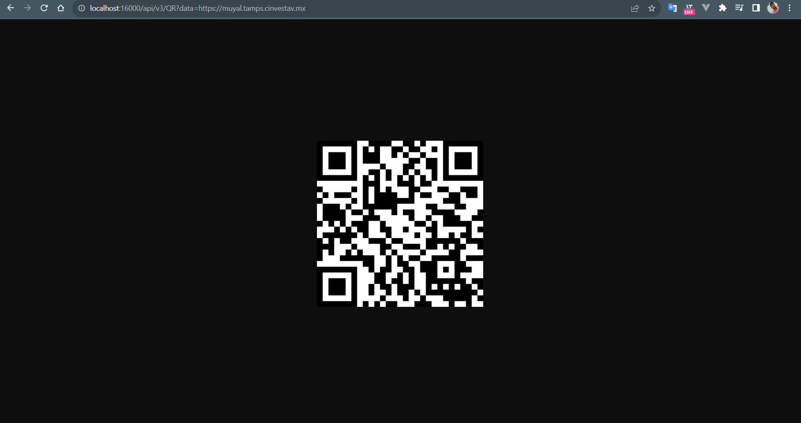

# Virtualization demos

In this readme file you'll see the commands to run the demos. The folder structure of this project it is as follows: 

```bash
.
├── README.md
├── demos.zip
└── images
    └── demo1_result.png

1 directory, 3 files
```
After you decompress the ```demos.zip``` you're gonna see the following folder structure: 

```bash
.
├── README.md
├── demo0
│   ├── Dockerfile
│   ├── Dockerfile_server
│   ├── README.md
│   ├── data
│   ├── requirements.txt
│   └── src
├── demo1
│   ├── Dockerfile_sharing
│   ├── README.md
│   ├── bin
│   ├── demo1.sh
│   └── demo1_v1.sh
├── demo2
│   ├── Dockerfile_sharing
│   ├── Dockerfile_xolo
│   ├── README.md
│   ├── auth.sh
│   ├── bin
│   ├── create_app.sh
│   ├── create_scope.sh
│   ├── demo2.sh
│   ├── generate_qr.sh
│   ├── payloads
│   └── signup.sh
├── demo3
│   └── README.md
├── demo4
│   ├── README.md
│   ├── demo2.yml
│   └── docker-compose.yml
├── demo5
│   └── README.md
└── images
    └── demo1_result.png

13 directories, 24 files
```
## Prerequisites
You must create a Docker network using the following command:
```bash
docker network create -d bridge <NETWORK_NAME> --subnet=10.0.0.1/25
```

## 1. Install
The only thing you need for this course is Docker, the instructions depends mainly of your operating system, so it is better that you go to the official web page of the virtual container platform Docker: https://docs.docker.com/engine/install/

Also I recommend installing the following http client:
https://httpie.io/desktop

## 2. Download / Clone
To get the project you need to download this repo or clone it, if you select to clone then:
```bash
git clone git@gitghub.com:nachocodexx/vc-course-demos
```


## 3. Hands-On

### Demo 0: Introduction to docker containers (Web server)
This demo show you how to create an basic python image and a basic web server using Flask then deploy all the services using docker compose.

All the commands are relative to the /demo0 folder, please ensure that you are in that folder, if you dont then:
```bash
cd <PATH>/demo0  
```
The ```<PATH>``` is the path where you saved this repo if you dont have the repo please go to the section 2. Download / Clone

Now you are ready to continue this demo is a simple qr generator to share whatever you want using a qr code.

### Demo 1: First virtual container (Sharing)
All the commands are relative to the /demo1 folder, please ensure that you are in that folder, if you dont then:
```bash
cd <PATH>/demo1  
```
The ```<PATH>``` is the path where you saved this repo if you dont have the repo please go to the section 2. Download / Clone

Now you are ready to continue this demo is a simple qr generator to share whatever you want using a qr code.

### Getting started

1. Create a new docker image using the following command:
```sh
 docker build -f Dockerfile_sharing -t <username>/demo1 .
```
Please replace the ```<username>``` with your Github username if you dont have a Github account then let it blank.

2. Deploy a container using the bash script:
```bash
chmod +x ./demo1.sh && ./demo1.sh
```
This command add execute permission to the file ```demo1.sh``` then execute it. This run a new virtual container that runs on port ```16000```. If you go to http://localhost:16000/api/v3/QR?data=https://muyal.tamps.cinvestav.mx

You'll see something like that: 




1. Get the list of all the deployed containers in your computer:
```bash
docker ps -a
```


### Demo 2: Auth service - communication model 

All the commands are relative to the /demo1 folder, please ensure that you are in that folder, if you dont then:
```bash
cd <PATH>/demo2
```
The ```<PATH>``` is the path where you saved this repo if you dont have the repo please go to the section 2. Download / Clone

Now you are ready to continue this demo is a simple qr generator to share whatever you want using a qr code.

Now you are ready to continues this demo is a simple qr generator to share whatever you want using a qr code but first you need to generate an authorization token that must attach to every request in order to be an authorized user. MictlanX Xolo is responsible for the authentication process.

## Getting started

1. Create a new docker image using the following command:

QR Sharing image:
```sh
docker build -f Dockerfile_sharing -t <username>/demo2 .
```
Xolo image:
```bash
docker build -f Dockerfile_xolo -t <username>/xolo-demo2.
```

2. Deploy a container using the bash script:
```bash
chmod +x ./demo2.sh && ./demo2.sh 
```
3. Get the list of all the deployed containers in your computer:
```bash
docker ps -a
```
4. Perform a simple request to generate a QR:

    In this demo first we need to create a ```SCOPE``` using the following script:
    ```bash
    ./create_scope.sh test
    ```
    ```console
    HTTP/1.1 200 OK 
    content-length: 82
    content-type: application/json
    date: Mon, 11 Sep 2023 05:51:59 GMT  
    {
        "id": "test_H02DHtOnAYJPyYdmOr7nHzsVnQt3jJ01",   
        "display_name": "test",
        "metadata": {}
    }
    ```

    Now using the field ```id``` you can generate an application: 
    ```bash
    ./create_app.sh test test_H02DHtOnAYJPyYdmOr7nHzsVnQt3jJ01
    ```
    ```console
    HTTP/1.1 200 OK
    content-length: 133 
    content-type: application/json
    date: Mon, 11 Sep 2023 05:52:09 GMT
    {
        "id": "test_IOdehyaJqda64lLQ9Oj5zMfAAG2ES0al",   
        "display_name": "test",
        "scope_id": "test_H02DHtOnAYJPyYdmOr7nHzsVnQt3jJ01",
        "metadata":{}
    }
    ```
    Now you are ready to sign up a new user using the following commands:
    ```bash
    ./signup
    ```
    Please modify the json file ```./payloads/signup.json``` which contains the mandatory fields to create a user:
    ```json
    {
        "app_id":"test_IOdehyaJqda64lLQ9Oj5zMfAAG2ES0al",
        "client_id":"mictlanx-sharing-0",
        "secret":"t0p53cr3T#",
        "metadata":{
            "first_name":"Ignacio",
            "last_name": "Castillo"
        },
        "claims":{
            "role":"god"
        },
        "expires_in":1296000
    }    
    ```
    Then you can authenticate to generate a new authorization code to generate a new QR code:
    ```bash
    ./auth.sh 
    ```
    Please modify the json file ```./payloads/auth.json``` that contains the mandatory fields to authenticate:
    ```json
    {
    "app_id":"test_IOdehyaJqda64lLQ9Oj5zMfAAG2ES0al",
    "client_id":"mictlanx-sharing-0",
    "secret":"t0p53cr3T#"
    }
    ```
    Some example of the response of this endpoint is:
    ```console
    HTTP/1.1 200 OK
    content-type: application/json 
    date: Mon, 11 Sep 2023 05:54:02 GMT
    {
        "client_id":"mictlanx-sharing-0",
        "jti":"token-95FbWKiYUxShhZ2j",
        "metadata":{
            "first_name":"Ignacio",
            "last_name":"Castillo"
        },
        "service_time":548414,
        "token":"eyJhbGciOiJIUzI1NiJ9eyJleHAiOiIxNjk0NDEzNDQyIiwiaWF0IjoiMTY5NDQxMTY0MiIsImlzcyI6InRlc3RfSU9kZWh5YUpxZGE2NGxMUTlPajV6TWZBQUcyRVMwYWwiLCJqdGkiOiJ0b2tlbi05NUZiV0tpWVV4U2hoWjJqIiwic3ViIjoibWljdGxhbngtc2hhcmluZy0wIn0.FKb18nOLl9HIyifk-YYO7dAP27OmX5tw93uhfbw4uU8"
    }   
    ```

    Finally we have all the mandatory fields to generate a QR code:
    ```bash
    ./generate_qr.sh \
        <APP_ID> \
        <CLIENT_ID> \
        <SECRET> \
        <TOKEN> \
        > <OUTPUT_PATH>/qr.png
    ```
